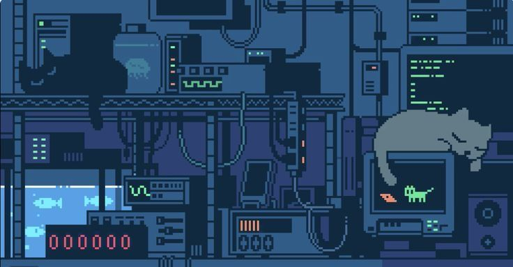

<div align="center">



### `< building stuff on the web />`


</div>

---

## 👋 Hey there, I'm Kaaru

I'm a developer who loves crafting clean, functional web experiences — from robust backends to snappy frontends. Currently leveling up my low-level programming skills, one pointer at a time.

> *"First, solve the problem. Then, write the code."*

---

## 🛠️ What I Work With

**Backend**
- 🔴 **Laravel** — my bread and butter for building scalable APIs and full-stack web apps

**Frontend**
- ⚛️ **React** + **TypeScript (TSX)** — building type-safe, component-driven UIs

**Currently Learning**
- ⚙️ **C++** — diving into the fundamentals: memory management, pointers, and everything the browser hides from you

---

## 🚀 Projects & Skills Snapshot

| Area | Technologies |
|------|-------------|
| 🌐 Full-Stack Web | Laravel · React · TypeScript |
| 🎨 Frontend | TSX · CSS · Component Design |
| 🔧 Backend | PHP · REST APIs · MVC |
| 📚 Learning | C++ · Basic Fundamentals |

---

---

## 🌱 Current Chapter

```cpp
// Kaaru's current focus
#include <iostream>

int main() {
    std::string status = "Learning C++ from scratch";
    std::string stack  = "Laravel + React + TSX";
    std::string goal   = "Become a more well-rounded dev";

    std::cout << "Status: " << status << std::endl;
    std::cout << "Stack:  " << stack  << std::endl;
    std::cout << "Goal:   " << goal   << std::endl;

    return 0;
}
```

---

## 📫 Let's Connect

<div align="center">

Feel free to reach out — always open to cool projects and good conversations.

[](https://github.com/kaaru)

</div>

---

<div align="center">

*Thanks for stopping by! ⚡*

</div>
